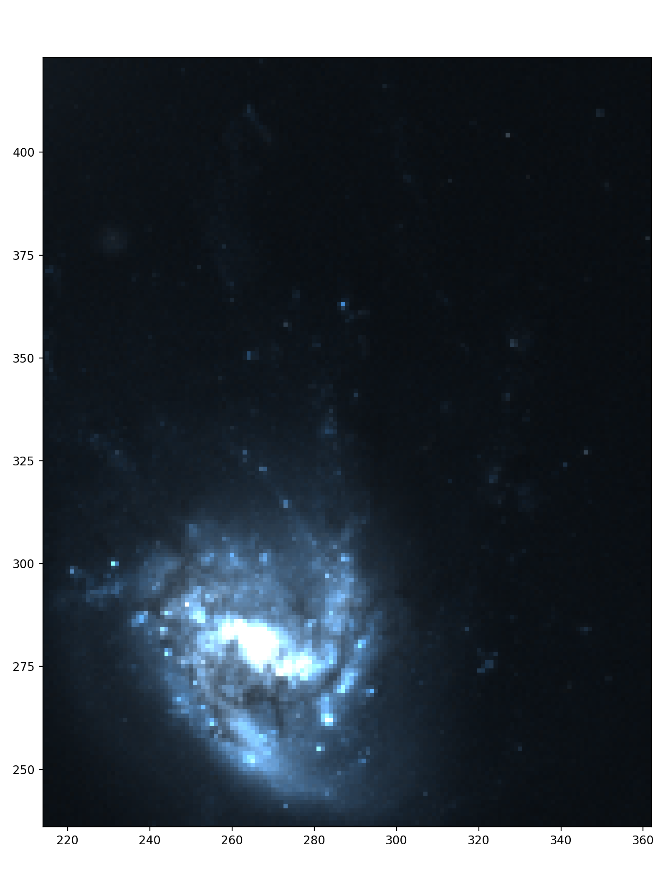

Getting Started
===============

The following documentation outlines how to load in data, from an initial cube, to moment maps, to additional data 
in both single frame and RGB image form.

Initial CubeSPA object
----------------------

To begin using CubeSPA, create a ``cubespa.CubeSPA`` object with the filename for your cube in the following way:
    
    >>> import cubespa
    >>> filename = "path/to/cube.fits"
    >>> c = cubespa.CubeSPA(cube_fn)

You can load in moment maps (assuming the convention from  `maskmoment <https://github.com/tonywong94/maskmoment>`_ ) with the following. If your maskmoment output is 
``path/to/maskmoment.mom0.fits.gz``, for the moment 0 map (.mom1, .mom2 for the others), these are loaded as follows below. With
moment maps loaded, you can also create a bounding box around "valid" data by calling the ``limits = "auto"`` feature.

    >>> filename = "path/to/cube.fits"
    >>> mommaps = "path/to/maskmoment"
    >>> c = cubespa.CubeSPA(cube_fn, mom_maps=mommaps, limits="auto")

Additional data
---------------

Additional data that doesn't require a full cube object can be loaded as a ``cubespa.DataSet()`` object. 
Note that all of the data in the cubeSPA object loaded above are also cubespa.DataSet() objects, which stores
the wcs and header information for easier access.

For example, if you had an H-alpha map of your galaxy, you might load it as follows:

>>> halpha = cubespa.load_data(halpha_fn, label="HALPHA")

However, this map might not be aligned with your cube. CubeSPA uses the `reproject <https://reproject.readthedocs.io/en/stable/>`_
package to properly align maps together. Once you have your ``DataSet`` object, you can align it with

>>> halpha_interp = cubespa.align_image(c.mom_maps.mom0, halpha)

where we are using the moment 0 map to align the images. CubeSPA *should* be able to automatically 
align images with a cube directly, where it will do some wcs ``dropaxis`` trickery to try and match things
together.

Lastly, it is good practice to add these datasets to the parent CubeSPA object's ``additional_maps`` attribute:

>> c.additional_maps.extend([halpha_interp, (...)])

RGB images
----------

``matplotlib`` is notoriously tricky for RGB images of astronomical data. CubeSPA has some built-in features 
to improve the experience with displaying RGB data, particularly HST images. 

For example, if we load in an hst image and then create an aligned image, we can see what it looks like by 
default with the following code:

>>> hst = cubespa.load_data(hst_fn, rgb_index=None, label="HST")
>>> hst_interp = cubespa.align_image(c.mom_maps.mom0, hst)

>>> test = hst_interp.data.transpose(1,2,0) # Transpose the data into the proper rgb pixel format for matplotlib

>>> cubespa.plotting.plot_rgb(test, lims=np.array(c.limits), outname="./rgb_nonorm.png")

This returns the following.

The RGB image can be histogram-normalized by doing the following:

>>> norm = cubespa.normalized_rgb_image(hst_interp.data, sigma=(2, 5))
>>> cubespa.plotting.plot_rgb(norm, lims=np.array(c.limits))

where ``sigma`` defines the lower and upper bounds to stretch each RGB frame to. This returns a map that 
look like:

.. image:: plots/rgb_norm.png
  :width: 400
  :alt: Alternative text

If the user wants to look at faint features, simply decrease the upper stretch. This will increase the visibility
of faint features at the cost of saturating the central disk.

>>> norm = cubespa.normalized_rgb_image(hst_interp.data, sigma=(2, 1))
>>> cubespa.plotting.plot_rgb(norm, lims=np.array(c.limits))

.. image:: plots/rgb_faint.png
  :width: 400
  :alt: Alternative text

Cutouts and Regions
-------------------

To create specific cutouts (for analysis of certain regions), the user supplies the parent CubeSPA object, 
the central location of the cutout, and the size of the cutout (either as an int, for a square, or as a 
tuple to establish a rectangular region). The output is a new CubeSPA object where the cube, moment maps, 
and any additional maps are trimmed to the location and size of the cutout. 

For example, if I was looking at 3 different regions (blob, fallback, and outskirts) for some datacube of a
galaxy, I would create it with the following.

>>> blob = cubespa.gen_cutout(c, (345, 290), 15, show_bbox=True)
>>> fallback = cubespa.gen_cutout(c, (305, 310), (20, 15), show_bbox=True)
>>> outskirts = cubespa.gen_cutout(c, (270, 403), (15, 35), show_bbox=True)

The additional parameter ``show_bbox`` will generate a plot to show you where the cutout falls on the parent
image. This is helpful for more closely aligning the cutouts.

Reference/API
-------------

.. automodule:: cubespa.cubespa
   :members:
   :undoc-members:
   :show-inheritance:
