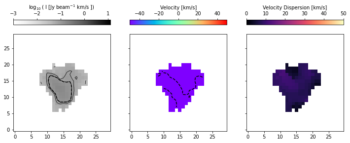

Generating Moment Maps
======================

Generating moment maps is trivially easy using CubeSPA. 

To make a display of the moment maps, simply do the following:

>>> import cubespa
>>> c = cubespa.CubeSPA(cube_filename, mom_maps=mom_maps_filename)
>>> c.plot_moment_maps()

If you have made some cutouts of your object, you can do the same, but it is recommended that you
set ``use_limits`` to ``False`` as the limits are related directly to the parent cube object.

>>> blob.plot_moment_maps(use_limits=False)

Reference/API
-------------

.. automodule:: cubespa.plotting.mommap_plots
   :members:
   :undoc-members:
   :show-inheritance:
