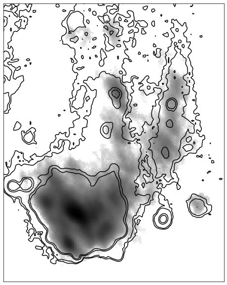
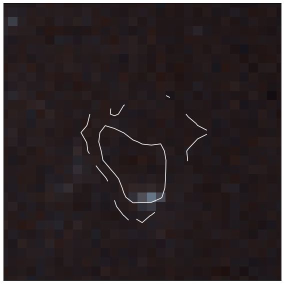

Making Overlays 
===============

Overlays are useful features to display isophotal contours of one image onto another.

Once you have aligned datasets (see getting_started), you can create an overlay by using:

>>> cubespa.plotting.overlay_plot(c.mom_maps.mom0, c.additional_maps[0], 
...                               lims=c.limits, levels=[10, 20, 100, 150])

where in this instance, we are showing the moment 0 CO distribution with H-alpha contours overlaid in black. 
The output plot looks like this:

For an RGB image, use the following instead:

>>> norm = cubespa.normalized_rgb_image(hst_interp.data, sigma=(2, 1))
>>> cubespa.plotting.rgb_overlay(norm, c.mom_maps.mom0, 
...                              levels=[0.02, 0.05, 0.1, 1], lims=blob.limits, colors="white")

which plots CO contours on top of the HST RGB image, which for this region reveals
a small compact stellar feature at the head of the  "blob".