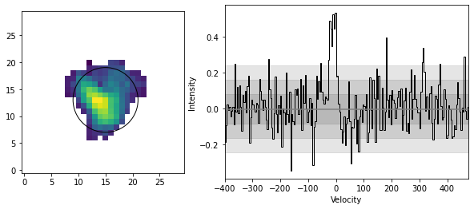

Spectral Analysis
=================

To generate spectra, the user specifies the location of the aperture (elliptical by default), and the shape. 
Continuing with our ``blob`` example, we generate spectra like so:

>>> blob.create_spectra((15, 13), (6, 6), plot=True)

This creates the following plot, showing the location of the spectral features in either velocity or channel
space. CubeSPA uses sigma clipping to determine an RMS of the spectra, and then plots the 1,2 and 3-sigma levels 
as a shaded grey region.

